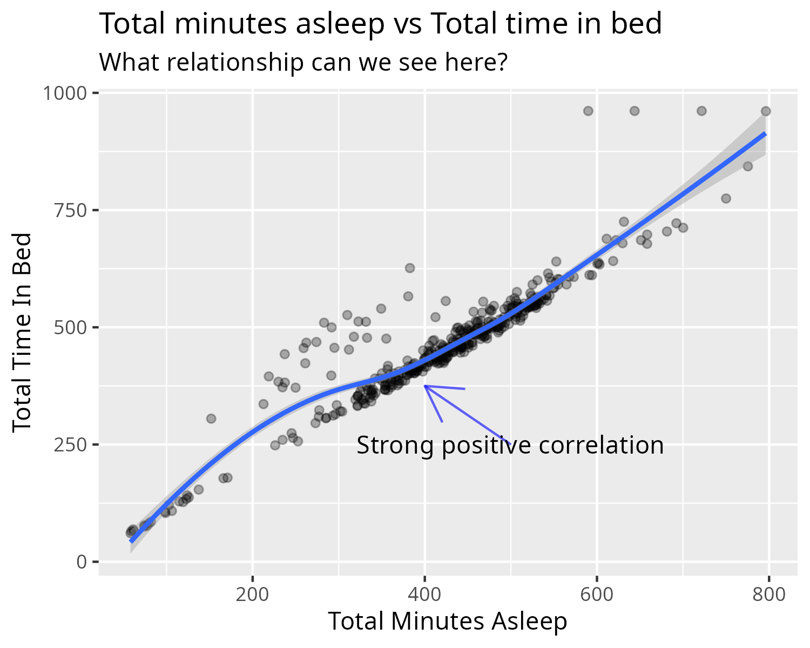
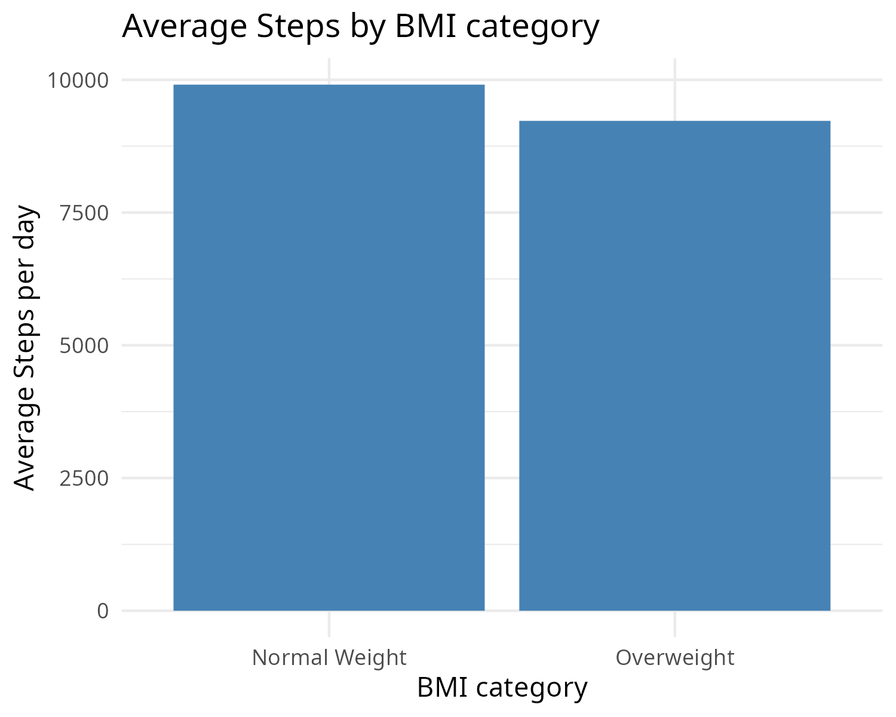

# Bellabeat Smart Device Market Analysis

## Project Overview
This project aims to analyze smart device fitness data to unlock new growth opportunities for Bellabeat, a high-tech manufacturer of health-focused products for women. The insights will guide the development of a marketing strategy tailored to consumer behavior.

## Statement of Business Task
The primary business task is to identify trends in smart device usage and apply these insights to Bellabeat's marketing strategy. This will help the company refocus its efforts to reach its target audience more effectively.

## Data Sources Description
The data used for this analysis comes from the FitBit Fitness Tracker Data available on Kaggle, specifically the dailyActivity, weightLogInfo, and sleepDay tables. The dataset was downloaded and stored locally for analysis. It is important to note that the data is from 2016 and does not cover daily app usage related to stress.

## Data Cleaning and Manipulation
The dataset underwent rigorous cleaning and manipulation processes. These included checking for missing data, verifying data types, removing spelling errors, and standardizing date formats with R. Manual review ensured the accuracy of the cleaned data.

## Findings
The analysis revealed several key trends:

- Physical activity levels correlate with sedentary behavior.
- Sleep patterns are closely tied to the time spent in bed.
- Step counts show little variation with body weight, suggesting limited effectiveness in promoting weight loss.

## Application to Bellabeat Customers
These trends suggest that Bellabeat's smart device could appeal to users who are conscious of their sedentary behavior and those valuing accurate sleep data. However, the limited effectiveness in promoting weight loss may require a shift in marketing focus towards overall wellness.

## Next Steps
Based on these findings, the next steps include:

- Confirming the insights through further research.
- Developing strategies to enhance the smart device's features.
- Revising the marketing strategy to highlight the benefits of sleep tracking and overall wellness.

---